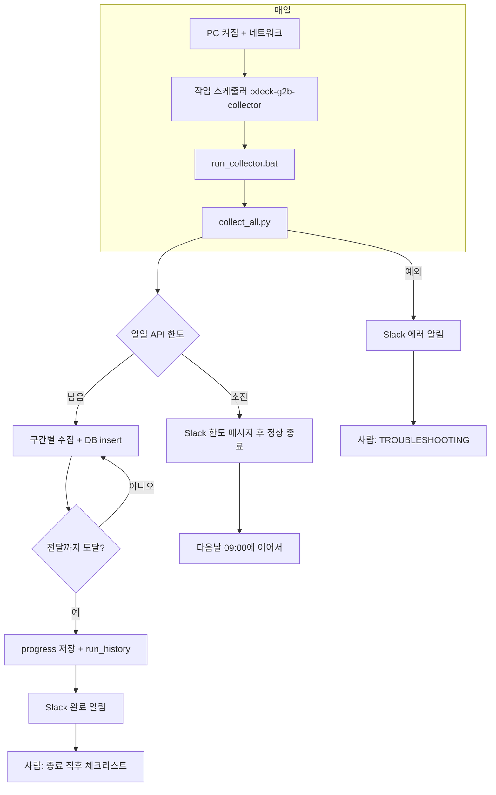

# G2B Collector 운영 워크플로우

수집이 **돌아가는 동안**과 **한 번 끝난 직후**에 사람이 해야 할 일을 구분해 둔다. 자동화는 진행 위치·DB insert·Slack 알림까지 담당하고, 검증·기록·후속 작업은 이 체크리스트로 이어간다.

**관련 문서:** [OPERATIONS.md](OPERATIONS.md) (원칙·역사), [TROUBLESHOOTING.md](TROUBLESHOOTING.md) (429·장애). 팀 전달·배경 요약은 Obsidian Second Brain의 `프로젝트 배경`·`수집 타임라인` 노트와 맞춰 보면 된다.

---

## 수집 범위 목표 (2026-03 계약월까지)

- **목표:** 네 종류(물품·공사·용역·외자) 포함, **계약월 기준 2026년 3월까지** 데이터를 갖춘다.
- **`collect_all.py` 동작:** 실행 시점의 **달력 “이번 달”의 전달**까지만 루프한다.  
  - 예: **2026년 3월**에 돌리면 상한은 **2026년 2월**까지.  
  - **2026년 3월** 계약월까지 넣으려면 **2026년 4월 1일 이후**에 도는 배치부터 상한이 **2026년 3월**이 된다.
- **완료 판단:** 로그에 `…년 …월까지 모든 데이터 수집 완료`가 찍히고 progress가 한도 월을 넘기거나, DB에서 **2026-03** 구간이 기대대로 채워졌는지 집계로 확인.
- **누락 점검:** 순차 수집 후 [fill_gaps.py](collectors/g2b/fill_gaps.py)의 `END_YEAR`/`END_MONTH`가 이 목표와 맞는지 확인한다.

---

## 한눈에: 누가 무엇을 하나

| 구간 | 자동 (스크립트·스케줄) | 사람 |
|------|------------------------|------|
| 매일 09:00 전후 | 작업 스케줄러 → `run_collector.bat` → `collect_all.py` | PC 전원·로그온(작업이 Interactive면) |
| 실행 중 | API 호출, DB insert, progress 저장, `progress_backup.json` | 필요 시 `collector.log` tail |
| 종료 시 | Slack(시작/완료/한도/에러), `run_history` 기록 | 아래 **「1회 실행 종료 직후」** |
| 주기 점검 | — | `status.ps1` 또는 `monitor_health.py` |
| 전 구간 완료 후 | — | gap 점검, 검증, 보내기·팀 전달 등 |

---

## 전체 흐름 (다이어그램)



---

## 사전 조건 (자동이 돌기 전)

- [ ] `.env`: `API_KEY`, `DATABASE_URL`, `SLACK_TOKEN`, `SLACK_CHANNEL_ID`
- [ ] `.\.conda\python.exe` 동작
- [ ] 작업 스케줄러 `pdeck-g2b-collector` **Ready**, `NextRunTime`이 기대와 맞음
- [ ] 수집기 경로가 [run_collector.bat](run_collector.bat)와 일치
- [ ] 작업을 새로 잡았다면 [scripts/register_task.ps1](scripts/register_task.ps1)로 **작업 디렉터리·실행 시간 제한 없음**이 들어갔는지 확인(재등록 한 번이면 됨)

빠른 확인:

```powershell
powershell -ExecutionPolicy Bypass -File .\scripts\status.ps1
```

---

## 1회 실행 종료 직후 (Slack 완료·한도·에러 후 공통으로 할 일)

수집 프로세스가 끝나면 **같은 날 안에** 아래를 순서대로 보면 된다. (완료 알림이 와도 스킵하지 말 것 — 후속 작업이 쌓이는 구간이다.)

### 필수 (짧게)

1. **Slack 메시지** — 오늘 수집 건수, API 사용량, 에러 요약이 기대와 맞는지 10초 확인.
2. **`status.ps1` 또는 로그** — `LastTaskResult`가 성공(0)인지, `collector.log`에 해당 일자·`작업 완료` 흐름이 있는지.
3. **`progress_backup.json`** — `current_job` / 연·월, `total_collected`, `last_run_date`가 한 단계 진행됐는지(또는 한도 종료면 그날짜만 맞는지).

### 권장 (수집이 쌓일수록 중요)

4. **DB 스팟 체크** (주 1회 이상도 OK) — 최근 `contracts` row 수 증가, 이상 구간 없는지.
5. **`run_history`** — 오늘 행이 들어갔는지 (수집 0건이어도 기록되는지 코드 기준 확인).
6. **Obsidian / Second Brain** — 작업일지 1줄 또는 `수집 타임라인` 노트에 날짜·진행 위치만 갱신 (숫자는 복붙보다 `progress_backup.json`·`status.ps1` 기준이 안전).

### 한도로 조기 종료된 날

- **정상 동작**일 수 있음. 다음날 스케줄이 이어서 돌게 두면 된다.
- 그날 할 일: 로그에 한도 메시지 확인, **progress가 저장됐는지**만 보면 된다.

### 에러로 종료된 날

- [TROUBLESHOOTING.md](TROUBLESHOOTING.md) → 필요 시 [OPERATIONS.md](OPERATIONS.md) 장애 절.
- `progress 위치 이상` Slack이 오면 `reset_progress.ps1` 검토.

---

## 수집이 “끝에 가깝다” / 전 구간 순회 완료 후

`collect_all.py`가 **수집 범위 끝(전달까지)** 에 도달해 루프를 빠져나오면, 자동으로는 다음 구간·다음 job으로 progress만 넘어간다. **그 다음 단계**는 사람이 택한다.

| 우선순위 | 작업 | 비고 |
|----------|------|------|
| 1 | [collectors/g2b/fill_gaps.py](collectors/g2b/fill_gaps.py) 검토·실행 | 스크립트 주석: **전체 수집 완료 후** 누락 구간 재수집. API 한도 하루 단위. |
| 2 | DB 품질·건수 검증 | 월별 건수, NULL 비율, 중복 키 등 프로젝트 목적에 맞게. |
| 3 | 보내기 / 팀 전달 | CSV, 접속 정보 공유, dump 등 — Second Brain `프로젝트 배경` 노트의 이관 옵션 참고. |
| 4 | 문서·저장소 정리 | `OPERATIONS.md` 마일스톤 한 줄, README 상태, GitHub 수동 워크플로 필요 여부. |

---

## 주간·비정기 점검

- **작업 스케줄러 `LastTaskResult`가 0이 아닐 때:** [OPERATIONS.md](OPERATIONS.md) 장애 대응 §6 (예: `3221225786` / 로그에 당일 시작 행 없음).
- **로컬:** `.\.conda\python.exe monitor_health.py`  
  - Slack으로내려면: `$env:SEND_SLACK_NOTIFICATION="true"` 후 실행 (Windows PowerShell).
- **GitHub:** `schedule:` 이 다시 생겼는지 워크플로 두 파일만 빠르게 grep.
- **보안:** `.env`·토큰이 저장소에 올라가지 않았는지, 백업 정책 확인.

---

## 운영 문서를 바꿀 때

- 실행 주체·스케줄·Slack 동작을 바꾸면 **[OPERATIONS.md](OPERATIONS.md)를 먼저** 고친 뒤, 이 워크플로와 README·Obsidian 요약을 맞춘다.
- **이 파일**은 “언제 무엇을 사람이 하는지”에 집중하고, 세부 원인 분석은 TROUBLESHOOTING에 둔다.

---

## 빠른 명령 모음

```powershell
# 상태 한 번에
powershell -ExecutionPolicy Bypass -File .\scripts\status.ps1

# 수동 1회 수집
& .\.conda\python.exe -u collectors\g2b\collect_all.py

# 헬스체크
& .\.conda\python.exe monitor_health.py
```

```powershell
# 헬스체크 + Slack (선택)
$env:SEND_SLACK_NOTIFICATION = "true"
& .\.conda\python.exe monitor_health.py
```
